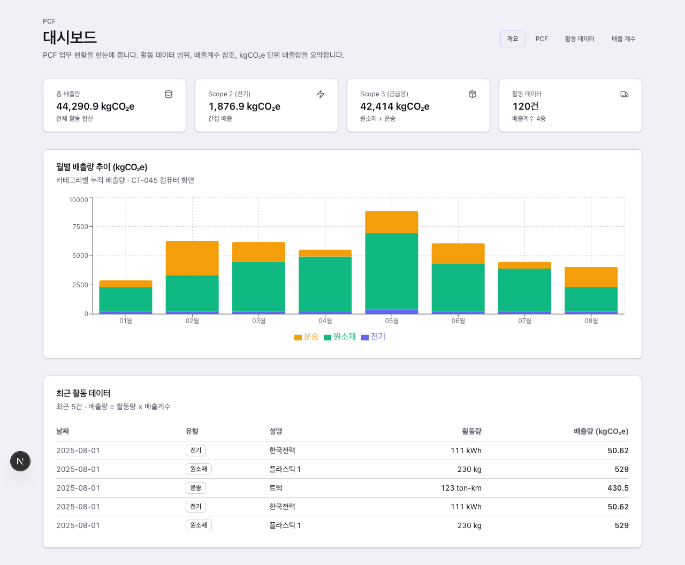
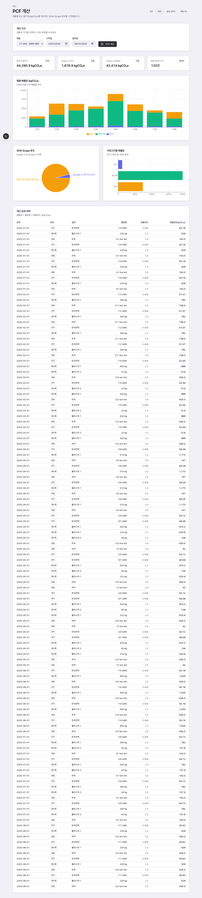
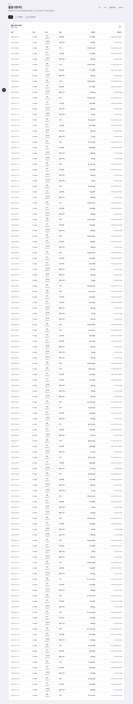
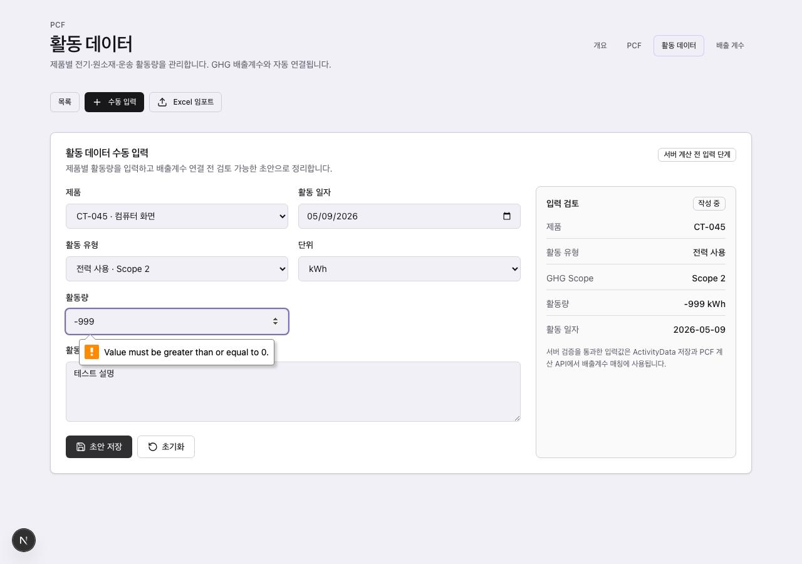
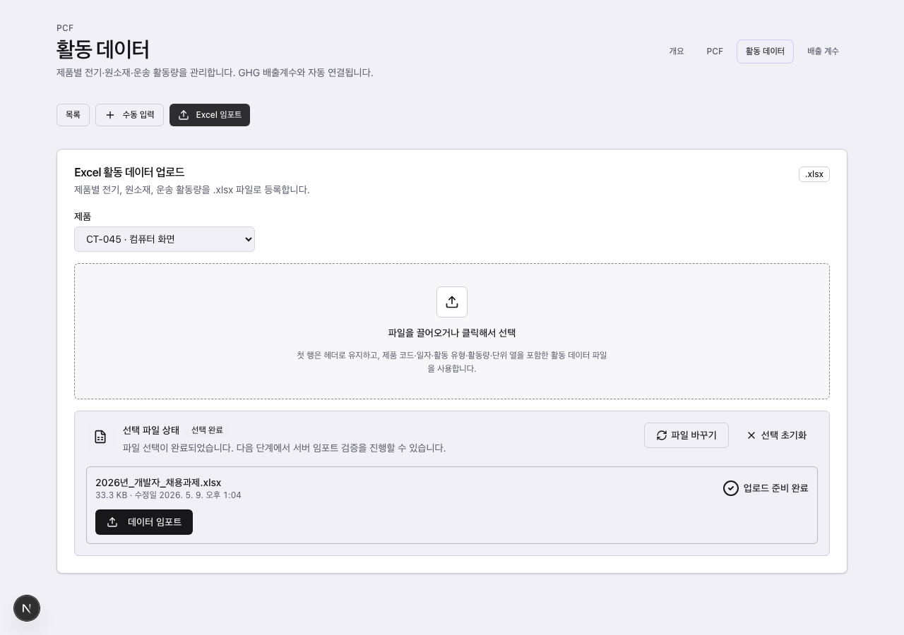
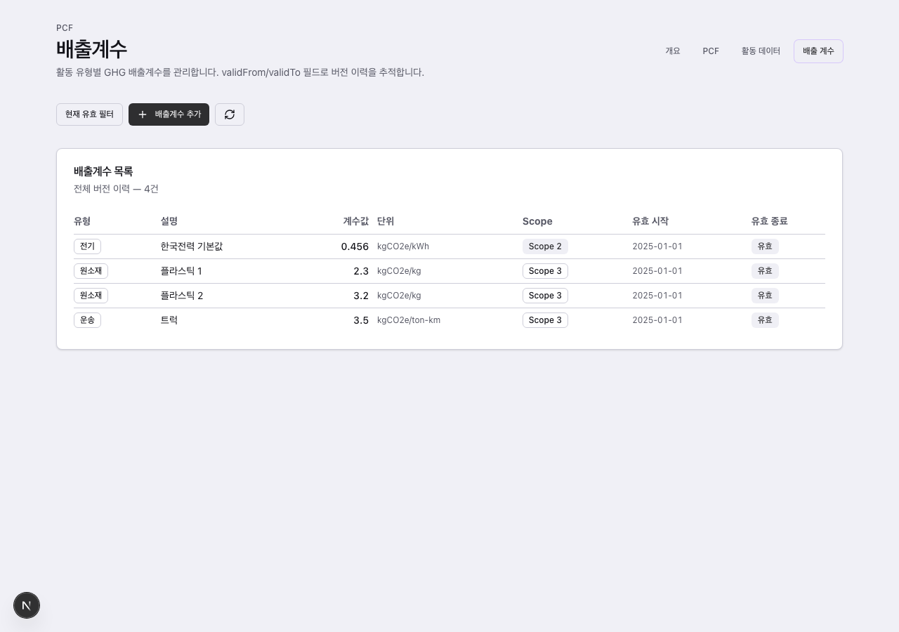

# Hanaloop PCF Dashboard

제품별 탄소 발자국(PCF, Product Carbon Footprint)을 계산하고 GHG Scope 분포를 시각화하는 대시보드입니다.

---

## 스크린샷

| 대시보드 | PCF 계산 결과 |
|---------|-------------|
|  |  |

| 활동 데이터 목록 | 입력 에러 메시지 |
|---------------|---------------|
|  |  |

| Excel 임포트 (업로드 CTA) | 배출계수 관리 |
|------------------------|------------|
|  |  |

---

## 로컬 실행 (5단계)

```sh
# 1. 의존성 설치
yarn install

# 2. 환경변수 확인 — .env 파일이 이미 포함되어 있습니다
#    DATABASE_URL="file:./dev.db"

# 3. DB 스키마 생성
npx prisma db push

# 4. 시드 데이터 삽입 (CT-045 컴퓨터 화면 · 배출계수 4종 · 활동데이터 30건)
npx tsx prisma/seed.ts

# 5. 개발 서버 시작
yarn dev
```

브라우저에서 `http://localhost:3000/dashboard` 접속.  
API 문서는 `http://localhost:3000/docs` (Swagger UI)

---

## Docker로 실행

```sh
# 이미지 빌드 + 컨테이너 시작 (최초 실행 — 시드 데이터 포함)
docker compose up --build

# 이미 데이터가 있을 때 (시드 제외)
SEED=false docker compose up
```

`docker-compose.yml`의 `SEED: "true"` 환경변수로 최초 시드 여부를 제어합니다.  
SQLite DB는 Docker 볼륨 `db_data`에 영속화되어 컨테이너 재시작 후에도 유지됩니다.

---

## 주요 기능

| 페이지 | 경로 | 기능 |
|--------|------|------|
| 대시보드 | `/dashboard` | 총 배출량 요약 카드, 월별 누적 바차트, 최근 활동 테이블 |
| PCF 계산 | `/dashboard/pcf` | 제품·기간 선택 → PCF 계산 → Scope 파이차트, 카테고리 바차트, 월별 추이, 상세 테이블 |
| 활동 데이터 | `/dashboard/activity-data` | 목록 조회, Zod 검증 수동 입력 폼, Excel 일괄 임포트 |
| 배출계수 | `/dashboard/emission-factor` | 계수 목록, 신규 등록, 버전 이력 |
| API 문서 | `/docs` | Swagger UI (OpenAPI 3.0) |

### PCF 시각화 구성

PCF 계산 결과 페이지는 4가지 시각화로 구성됩니다.

1. **요약 카드** — 총 PCF(kgCO₂e), Scope 2, Scope 3, 활동 건수를 한눈에 확인
2. **월별 누적 바차트** — 전기(파랑) / 원소재(초록) / 운송(노랑) 카테고리별 월간 배출 추이
3. **GHG Scope 파이차트** — Scope 2 vs Scope 3 비중을 퍼센트로 표시
4. **카테고리별 가로 바차트** — 전기 / 원소재 / 운송 합계 비교
5. **상세 내역 테이블** — 날짜 · 유형 · 설명 · 활동량 · 배출계수 · 배출량(kgCO₂e) 전체 행 표시

**단위 표기**: 모든 배출량 값은 `kgCO₂e` 단위로 표시하며, 한국어 천 단위 콤마 포맷을 적용합니다.

### 에러 메시지

수동 입력 폼에서 잘못된 값 입력 시:
- **클라이언트 검증** (Zod): 필수 항목 미입력, 음수 활동량, 잘못된 날짜 형식 → 필드 아래 인라인 에러 표시
- **서버 검증** (422 응답): Zod 스키마 통과 실패 시 `fieldErrors` 형태로 반환, 폼 상단에 표시

---

## 시스템 설계

### 기술 스택

| 영역 | 기술 |
|------|------|
| 프레임워크 | Next.js 16 (App Router) |
| 언어 | TypeScript 5 |
| UI | React 19, Tailwind CSS 4, shadcn/ui |
| 차트 | Recharts 3 (BarChart, PieChart, ResponsiveContainer) |
| API | Next.js Route Handlers |
| ORM | Prisma 5 |
| DB | SQLite (로컬) / PostgreSQL 호환 스키마 |
| 검증 | Zod |
| Excel 파싱 | xlsx (서버사이드) |
| API 문서 | swagger-ui-react + OpenAPI 3.0 |

### 아키텍처 — FSD-lite

Feature-Sliced Design lite 구조를 채택했습니다. 기능 단위로 코드를 격리해 대규모 확장 시에도 의존성 방향을 명확하게 유지할 수 있습니다.

```
src/
├── app/                        # Next.js App Router
│   ├── api/                    # Route Handlers (API)
│   │   ├── activity-data/      # GET · POST
│   │   │   └── import/         # POST (Excel)
│   │   ├── emission-factors/   # GET · POST
│   │   │   └── [id]/           # PUT · DELETE
│   │   ├── pcf/
│   │   │   ├── calculate/      # POST
│   │   │   └── results/        # GET
│   │   ├── products/           # GET
│   │   └── docs/               # GET (OpenAPI JSON)
│   ├── dashboard/              # 대시보드 페이지
│   └── docs/                   # Swagger UI 페이지
├── entities/                   # 도메인 모델 + Zod 스키마
│   ├── activity-data/
│   └── emission-factor/        # mapActivityDataToEmissionFactor
├── features/                   # UI 기능 단위
│   ├── activity-manual-entry/  # 수동 입력 폼
│   └── activity-upload/        # Excel 업로드
└── shared/
    ├── lib/prisma.ts            # Prisma 싱글톤
    └── ui/                     # shadcn/ui 컴포넌트
```

### PCF 계산 로직

```
emission(i) = activity_amount(i) × emission_factor_value(i)   [단위: kgCO₂e]
PCF         = Σ emission(i)   ← 기간 내 모든 활동 데이터 합산

GHG Scope 분류
  Scope 2 → activityType = ELECTRICITY   (전기, 간접 배출)
  Scope 3 → activityType = RAW_MATERIAL | TRANSPORT   (원소재·운송, 밸류체인)
```

### 배출계수 자동 매핑

활동 데이터 입력 시 `activityType + description` 조합으로 DB에서 가장 적합한 배출계수를 자동 선택(`mapActivityDataToEmissionFactor`). 일치하는 계수가 없으면 `emissionFactorId = null`로 저장하고 PCF 계산에서 해당 행은 0으로 처리됩니다.

---

## ERD

```
Product
  id          PK  (cuid)
  code        UNIQUE  ── "CT-045"
  name
  createdAt / updatedAt
  │
  ├─── ActivityData (1:N)
  │      id               PK
  │      productId        FK → Product.id
  │      emissionFactorId FK? → EmissionFactor.id
  │      date
  │      activityType     ELECTRICITY | RAW_MATERIAL | TRANSPORT
  │      description
  │      amount           Decimal
  │      unit
  │      createdAt / updatedAt
  │
  └─── PcfResult (1:N)
         id          PK
         productId   FK → Product.id
         periodStart / periodEnd
         totalEmission  Decimal
         byScope        String  ── JSON: {"SCOPE_2": 469.22, "SCOPE_3": 10603.5}
         byCategory     String  ── JSON: {"ELECTRICITY": 469.22, ...}
         calculatedAt / createdAt / updatedAt
         UNIQUE(productId, periodStart, periodEnd)

EmissionFactor
  id          PK
  factorKey   ── "EF_ELECTRICITY_KR"
  version     INT  (자동 증가)
  activityType
  description
  value       Decimal
  unit        ── "kgCO2e/kWh"
  scope       SCOPE_2 | SCOPE_3
  validFrom / validTo
  UNIQUE(factorKey, version)
```

---

## 왜 이렇게 설계했는가

### 1. PCF를 수동 계산 버튼으로 트리거한 이유

PCF를 활동 데이터 저장 시마다 자동 재계산하면 DB 쓰기가 연쇄적으로 발생하고, 계산 시점이 불투명해집니다. 수동 트리거 방식은:

- `calculatedAt` 필드로 **언제 계산된 결과인지 명시**할 수 있습니다
- 동일 기간에 여러 번 계산해도 `UNIQUE(productId, periodStart, periodEnd)` 제약으로 **upsert(덮어쓰기)**가 되어 결과가 하나로 관리됩니다
- 사용자가 "지금 시점의 확정 PCF"를 의도적으로 생성한다는 **업무 흐름이 명확**합니다

### 2. 배출계수를 별도 테이블로 분리한 이유

배출계수는 시간이 지나면 갱신됩니다(예: 한국 전력 배출계수는 매년 고시값이 바뀜). ActivityData에 `emissionFactorId`(FK)를 저장하고 EmissionFactor를 별도 테이블로 관리하면:

- **`validFrom / validTo`** 필드로 버전 이력을 완전하게 추적합니다
- 배출계수가 바뀌어도 과거 활동 데이터의 FK는 **그 시점의 계수를 그대로 가리킵니다** — 재계산 시 과거 데이터가 오염되지 않습니다
- 새 버전 등록 시 version 자동 증가로 동일 factorKey의 이력을 한눈에 파악할 수 있습니다

---

## 설계 Trade-off

### SQLite의 Json 미지원 → String 저장

Prisma 5 + SQLite 조합에서는 `Json` 컬럼 타입이 지원되지 않습니다. `PcfResult.byScope`와 `byCategory`를 `Json` 대신 `String`으로 선언하고, API 계층에서 `JSON.stringify` / `JSON.parse`로 직렬화·역직렬화합니다.

**장점**: 로컬 개발에 SQLite를 그대로 쓸 수 있고, Prisma 스키마의 나머지 구조는 PostgreSQL과 완전히 동일합니다.  
**단점**: PostgreSQL로 마이그레이션 시 해당 컬럼의 타입을 `String → Json`으로 변경해야 합니다. 단, application 코드(`JSON.stringify/parse`)는 그대로 동작하므로 변경 범위는 스키마 1줄로 최소화됩니다.

---

## AI 사용 내역

이 프로젝트는 **Ouroboros**(Anthropic Claude Code 플러그인)의 Specification-First 워크플로를 사용해 개발되었습니다.

### 워크플로

```
ooo interview → ooo seed → ooo run (일부) → Claude Code 직접 구현
```

| 단계 | 도구 | 내용 |
|------|------|------|
| 요구사항 명확화 | `ooo interview` | Socratic 인터뷰 10문항. 배출계수 자동 매핑 방식, PCF 트리거(수동 버튼), Excel 컬럼 형식 등 7가지 가정을 검증. 모호성 점수 0.12로 수렴 |
| 스펙 결정화 | `ooo seed` | 인터뷰 결과를 `.seed/hanaloop-pcf.seed.yaml`로 변환. 11개 인수 기준(AC), 3개 종료 조건 정의 |
| 자동 구현 시도 | `ooo run` | Codex API가 AC 3/11 완료 후 할당량 소진 → Path B(직접 구현)로 전환 |
| 직접 구현 | Claude Code | 나머지 8개 AC를 직접 구현: Prisma 스키마 조정, API Route Handlers, PCF 페이지 차트, Excel 임포트, Swagger UI |

### 주요 기술 결정 (AI 제안 및 검증)

| 결정 | 이유 |
|------|------|
| Prisma 5 (not 6) | SQLite datasource `url` 호환성 — Prisma 6에서 breaking change |
| `byScope: String` | Prisma 5 SQLite에서 Json 타입 미지원 → JSON.stringify/parse 처리 |
| Product 조회 `OR [id, code]` | 프론트에서 제품 코드 문자열(CT-045) 전송 케이스 처리 |
| Excel 헤더 동적 탐색 | 과제 xlsx 상단에 제목·설명 행 2줄이 있어, "일자" 셀 위치를 동적으로 탐색 |
| Recharts `(v: unknown) =>` | Formatter 타입 시그니처 — `(v: number)`는 타입 에러 |

### 작업 소요 시간

| 구간 | 시간 |
|------|------|
| ooo interview + seed | ~1시간 |
| ooo run 시도 + 직접 구현 전환 | ~30분 |
| API 구현 (Prisma, Route Handlers) | ~2시간 |
| UI 구현 (차트, 폼, 업로드) | ~2시간 |
| Swagger, 버그 수정, README | ~1시간 |
| **합계** | **~6.5시간** |

---

## GitHub

저장소가 public이고 커밋 이력에 단계별 작업 내용이 기록되어 있습니다.

주요 커밋:
- `feat: add initial dashboard UI`
- `feat: implement PCF dashboard with calculation, charts, and data management`
- `feat: add Swagger UI at /docs with OpenAPI 3.0 spec`
- `feat: add import CTA and fix Excel header detection in upload flow`
